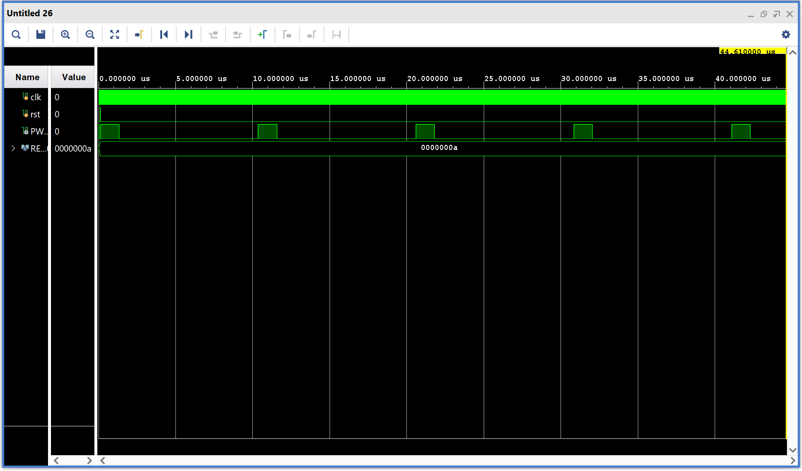

# PWM and PSM Implementations in Verilog

---

## Table of Contents

- [PWM Overview, Parameterization & Duty Cycle](#pwm-overview-parameterization--duty-cycle)  
- [Left-Aligned PWM](#left-aligned-pwm)  
  - [Advantages](#advantages)  
  - [Disadvantages](#disadvantages)  
  - [Example Outputs](#example-outputs)  
- [Center-Aligned PWM](#center-aligned-pwm)  
  - [Advantages](#advantages-1)  
  - [Disadvantages](#disadvantages-1)  
  - [Example Outputs](#example-outputs-1)  
- [Pulse Skipping Modulation (PSM)](#pulse-skipping-modulation-psm)  

---

## PWM Overview, Parameterization & Duty Cycle

Pulse Width Modulation (PWM) is used to generate variable-width pulses to control power delivered to a load. Both Left-Aligned and Center-Aligned PWM modules in this project are fully **parameterized** using:

- **RESOLUTION**: Number of bits used for the counter.
- **DUTY**: Value at which the output switches from high to low.

The counter runs from `0` to `TOP`, where:

`TOP = 2^RESOLUTION - 1`

Duty cycle is calculated as:

`DUTY = TOP × (required duty cycle)`

> **Note:** Increasing `RESOLUTION` gives finer control over the PWM waveform but **reduces the switching speed**, since a larger counter takes longer to complete a cycle. 

> In the current Implementation, we have a resolution of 10 bit, which amounts to 0.098% accuracy in duty cycle.

---

## Left-Aligned PWM

In Left-Aligned PWM, the output goes high at the start of the counting cycle and goes low when the counter exceeds `DUTY`.

### Advantages

- Simple and hardware-efficient  
- Suitable for general-purpose applications like LED dimming or fan control

### Disadvantages

- Produces more harmonic distortion  
- Not ideal for sensitive analog or motor control applications

### Output Waveforms

**12% Duty Cycle**

**50% Duty Cycle**

---

## Center-Aligned PWM

In Center-Aligned PWM, the counter counts up to `TOP` and then back down to `0`, producing a symmetric waveform around the center.

### Advantages

- Lower harmonic distortion  
- Better suited for motor drives and power electronics

### Disadvantages

- Requires additional logic (up-down counting)  
- Reduced switching frequency for same resolution

### Example Outputs

**12% Duty Cycle**

**50% Duty Cycle**

---

## Pulse Skipping Modulation (PSM)

A Pulse Skipping Modulation (PSM) module is currently under development and will be added soon.

